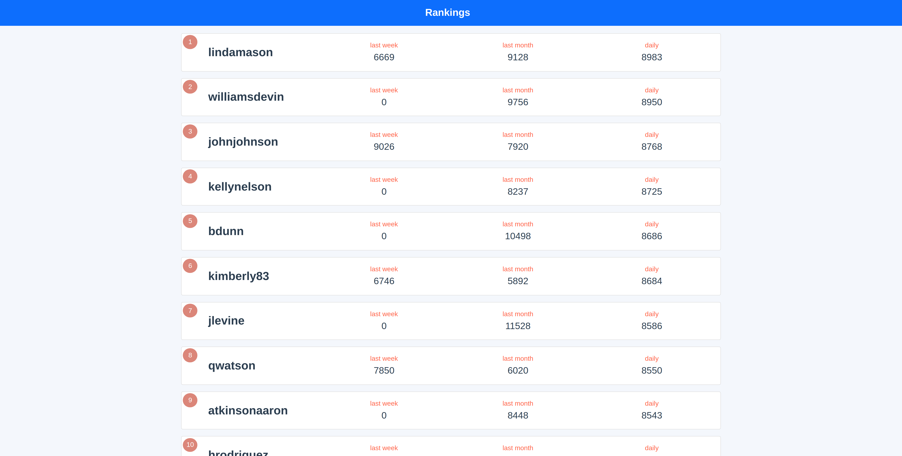
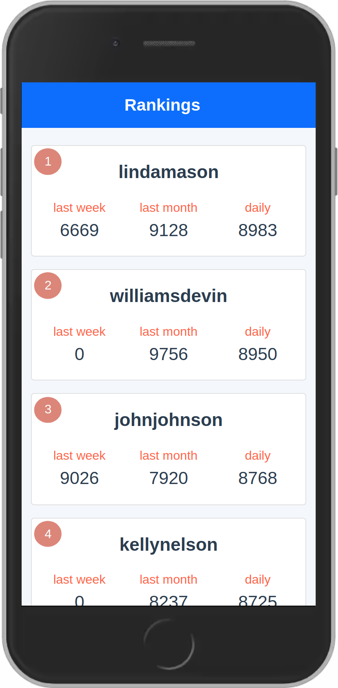
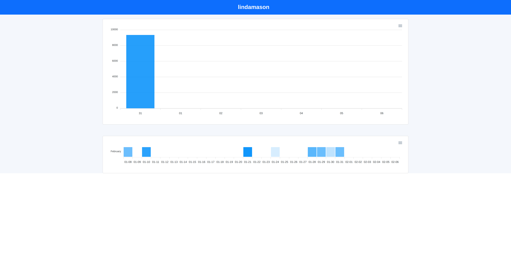
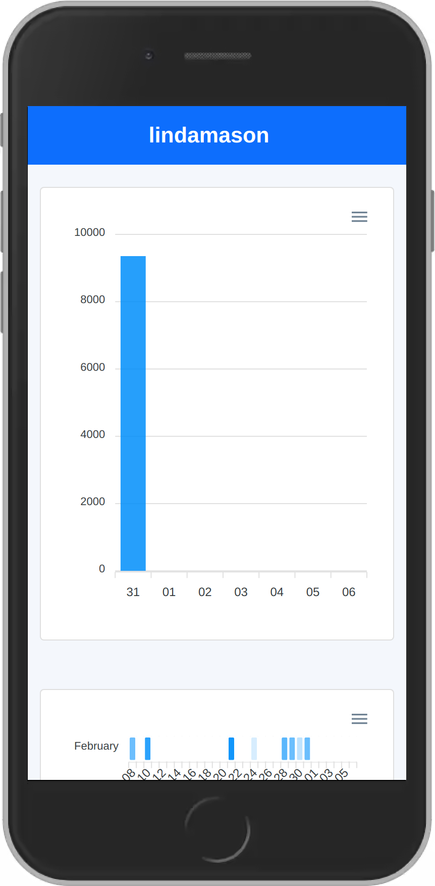

# daily-steps-ranking


## Screenshots

</br>

### Rankings
</br>



</br>

<p align="center">
  
</p>

</br>

## User

</br>



</br>

<p align="center">
  
</p>

</br>

## Project setup
```
npm install
```

### Compiles and hot-reloads for development
```
npm run serve
```

### Compiles and minifies for production
```
npm run build
```

### Run your unit tests
```
npm run test:unit
```

### Run your end-to-end tests
```
npm run test:e2e
```

### Lints and fixes files
```
npm run lint
```

### Customize configuration
See [Configuration Reference](https://cli.vuejs.org/config/).
